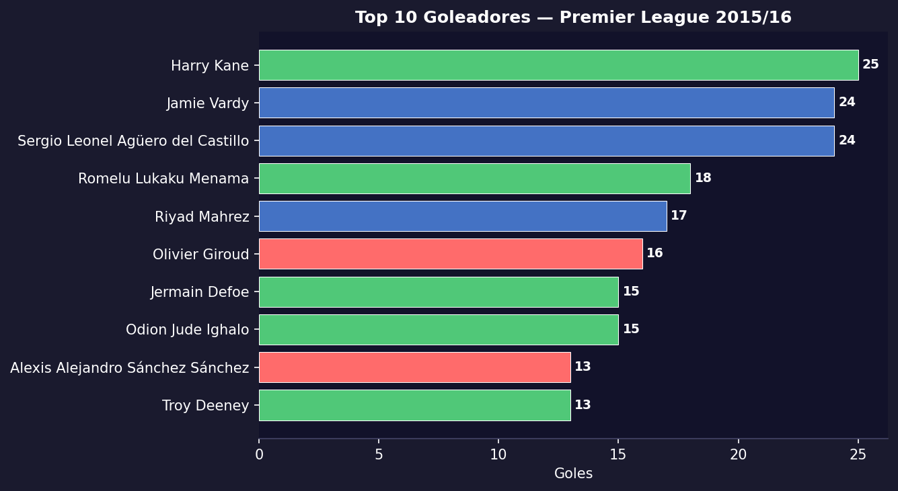
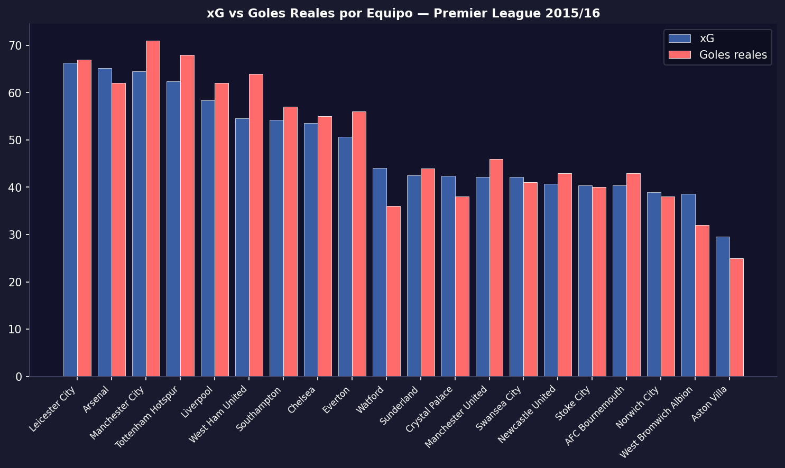
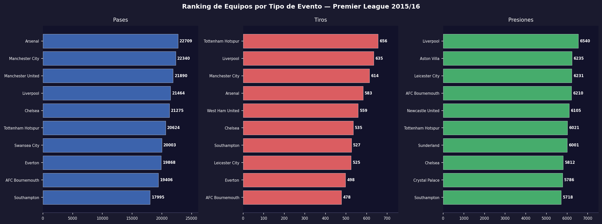
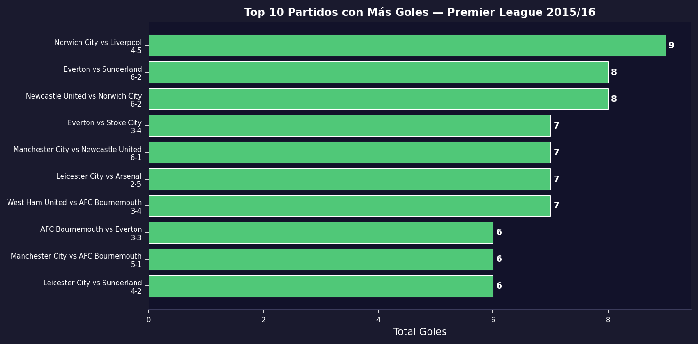

# Análisis de Temporada con SQL — Premier League 2015/16

Análisis estadístico de la temporada completa usando una base de datos **SQLite** con 1.3 millones de eventos de los 380 partidos de la Premier League 2015/16.

---

## Hallazgos principales

**1. Arsenal lideró en posesión, Tottenham en tiros**
Arsenal fue el equipo con más pases de la temporada (22,709), seguido de Manchester City (22,340). Sin embargo, Tottenham fue el equipo más amenazante con 656 tiros totales, superando a Liverpool (635) y Manchester City (614).

**2. Liverpool fue el equipo que más presionó**
Con 6,540 acciones de presión, Liverpool lideró ampliamente esta métrica — coherente con el estilo de Klopp que llegó en octubre de 2015.

**3. Harry Kane fue el máximo goleador**
Con 25 goles, Kane lideró la tabla de anotadores de la temporada, seguido de Jamie Vardy (Leicester City) cuya temporada histórica le llevó al título.

**4. El xG confirma la sorpresa de Leicester**
Leicester City ganó la liga con un xG modesto comparado con Arsenal o Manchester City, lo que indica que fueron muy eficientes de cara al gol — convirtieron más de lo esperado estadísticamente.

**5. Partidos más goleadores**
Los equipos recién ascendidos (AFC Bournemouth, Watford) tendieron a protagonizar los marcadores más abultados de la temporada.

---

## Visualizaciones

### Top 10 Goleadores



### xG vs Goles Reales por Equipo



### Ranking de Equipos por Tipo de Evento



### Top 10 Partidos con Más Goles



---

## Estructura de la Base de Datos

| Tabla | Filas | Descripción |
| --- | --- | --- |
| `matches` | 380 | Info de cada partido (equipos, resultado, fecha) |
| `events` | 1,313,783 | Todos los eventos de la temporada |
| `shots` | 9,908 | Tiros con xG y coordenadas x/y |

### Ejemplo de consulta SQL

```sql
-- Top 10 goleadores de la temporada
SELECT player, team, COUNT(*) AS goles
FROM shots
WHERE shot_outcome = 'Goal'
GROUP BY player, team
ORDER BY goles DESC
LIMIT 10;
```

---

## Tecnologías

- **Python 3** + **SQLite3** — base de datos local
- **statsbombpy** — descarga de datos abiertos
- **pandas** — manipulación y consultas
- **matplotlib** — visualizaciones

## Cómo ejecutar

```bash
pip install statsbombpy pandas matplotlib jupyter
jupyter notebook Season_Analysis_SQL.ipynb
```

> **Nota:** La base de datos `.db` no está incluida en el repositorio (139 MB).
> Se genera automáticamente al ejecutar los pasos 3–5 del notebook (5–10 min).

---

## Fuente de datos

[StatsBomb Open Data](https://github.com/statsbomb/open-data) — datos de uso libre para educación e investigación.

---

## Season Analysis with SQL — Premier League 2015/16

Full-season statistical analysis using a **SQLite** database containing 1.3 million events from all 380 matches of the 2015/16 Premier League.

| Top Scorers | xG vs Goals |
|---|---|
|  |  |

| Team Rankings | Top Matches |
|---|---|
|  |  |

### Key Findings

**1. Arsenal led in possession, Tottenham in shots**
Arsenal had the most passes of the season (22,709), followed by Manchester City (22,340). However, Tottenham was the most threatening side with 656 total shots, ahead of Liverpool (635) and Manchester City (614).

**2. Liverpool pressed the most**
With 6,540 pressure actions, Liverpool led this metric by a wide margin — consistent with Klopp's high-press style after arriving in October 2015.

**3. Harry Kane was the top scorer**
With 25 goals, Kane led the scoring charts, followed by Jamie Vardy (Leicester City) whose historic season powered them to the title.

**4. xG confirms the Leicester surprise**
Leicester won the league with a modest xG compared to Arsenal or Manchester City, showing they were highly efficient in front of goal — converting more than statistically expected.

**5. Highest-scoring matches**
Newly promoted sides (AFC Bournemouth, Watford) tended to be involved in the highest-scoring games of the season.

### Database Schema

| Table | Rows | Description |
| --- | --- | --- |
| `matches` | 380 | Match info (teams, score, date) |
| `events` | 1,313,783 | All season events (passes, shots, pressures, etc.) |
| `shots` | 9,908 | Shots with xG and x/y coordinates |

### Sample SQL Query

```sql
-- Top 10 scorers of the season
SELECT player, team, COUNT(*) AS goals
FROM shots
WHERE shot_outcome = 'Goal'
GROUP BY player, team
ORDER BY goals DESC
LIMIT 10;
```

### Tech Stack

- **Python 3** + **SQLite3** — local database
- **statsbombpy** — open data download
- **pandas** — data manipulation and querying
- **matplotlib** — visualizations

### How to Run

```bash
pip install statsbombpy pandas matplotlib jupyter
jupyter notebook Season_Analysis_SQL.ipynb
```

> **Note:** The `.db` file is not included in the repository (139 MB).
> It is generated automatically by running steps 3–5 of the notebook (5–10 min).

### Data Source

[StatsBomb Open Data](https://github.com/statsbomb/open-data) — free to use for education and research.
