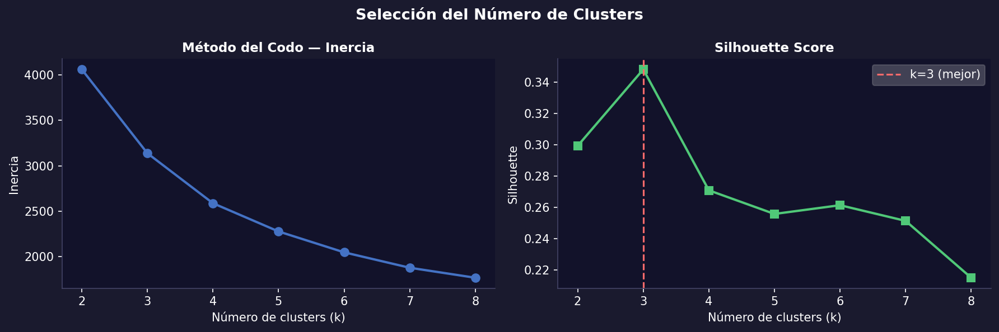
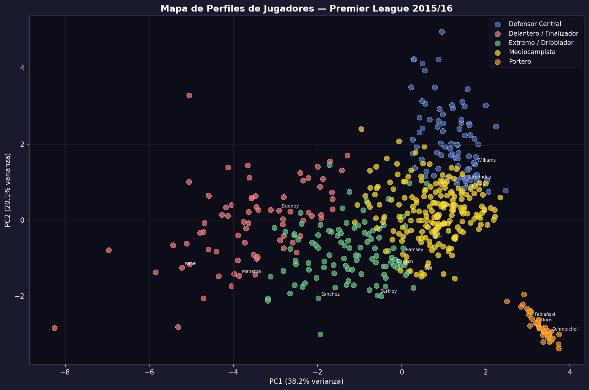
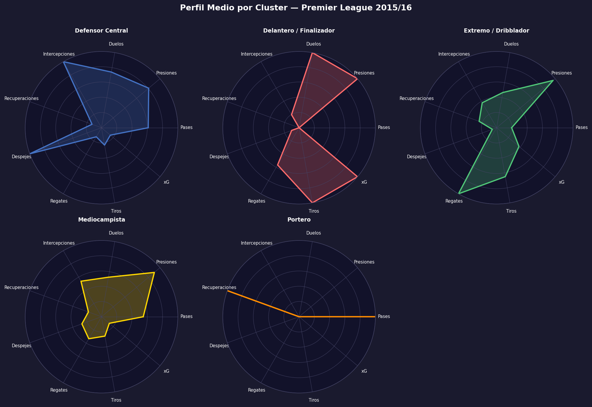
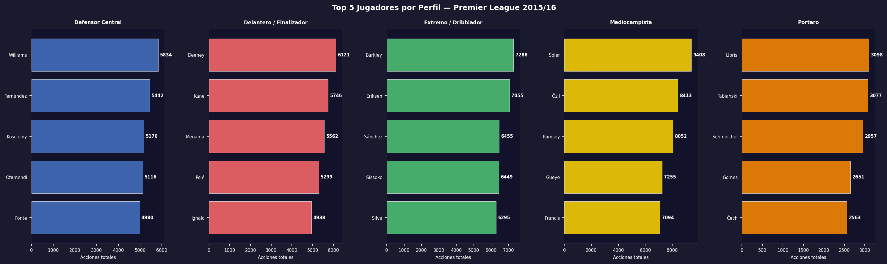
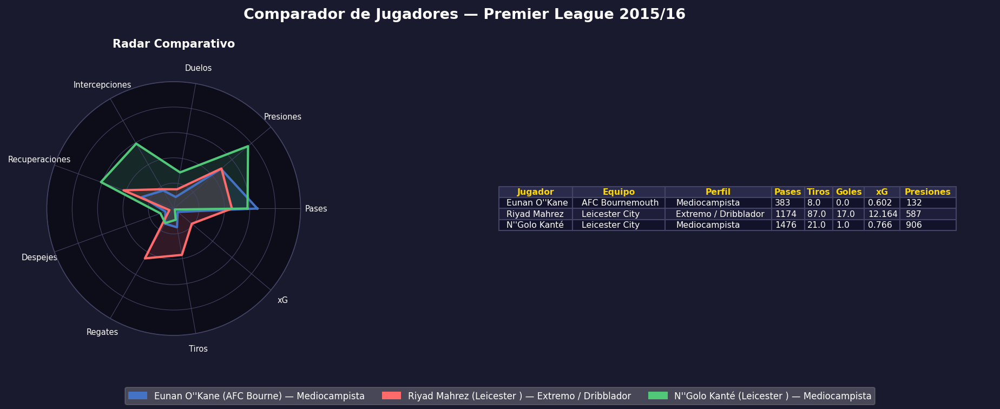
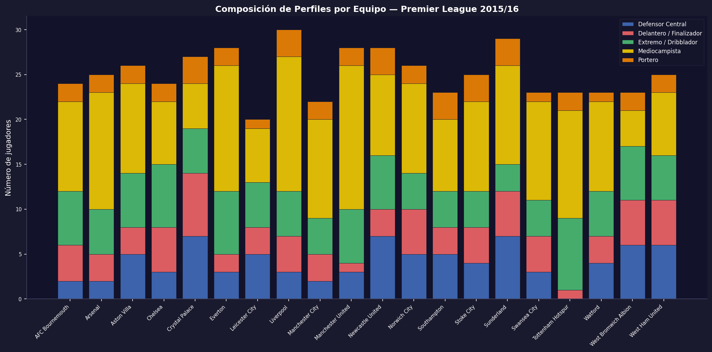

# Proyecto 03 — Perfiles de Jugadores con Machine Learning

Agrupación y análisis de **502 jugadores** de la Premier League 2015/16 usando KMeans clustering sobre datos de StatsBomb. El modelo identifica 5 perfiles tácticos de forma automática — sin usar ninguna variable de posición.

---

## Hallazgos principales

**1. El modelo aisló a los porteros sin saber que eran porteros**
El cluster de porteros emergió de forma completamente automática: cero tiros, prácticamente cero presiones. Es la validación más clara de que el modelo captura comportamiento real, no etiquetas.

**2. Leicester tenía 4 jugadores en el top de su categoría respectiva**
Kanté (presiones), Mahrez (regates + goles), Vardy (eficiencia de remate), Huth (acciones defensivas). Cuatro roles, cuatro líderes. El título no fue suerte.

**3. Riyad Mahrez: el extremo que marcó como delantero centro**
17 goles con solo 87 tiros — el jugador más eficiente de la temporada. Los delanteros de élite como Kane necesitaron casi el doble de intentos para un gol más.

**4. Agüero sobrerendió +6 goles sobre su xG esperado**
El mayor diferencial positivo de la temporada. Cameron Jerome (Norwich) fue el opuesto: -4 goles — Norwich descendió ese año.

**5. Virgil van Dijk ya era top-2 en acciones defensivas en su primera temporada**
El modelo lo posiciona como Defensor Central de élite antes de que el mercado lo reconociera como tal.

---

## Visualizaciones

### Selección del número de clusters (Elbow + Silhouette)



### Mapa PCA de perfiles de jugadores



### Radar de perfil medio por cluster



### Top 5 jugadores por perfil



### Comparador individual de jugadores



### Composición de perfiles por equipo



---

## Los 5 perfiles identificados

| Perfil | Jugadores | Características |
| --- | --- | --- |
| **Mediocampista** | 199 | Máximo en pases (969) y presiones (293) |
| **Extremo** | 105 | Máximo en regates (58/100 acc.) y conducción |
| **Defensor Central** | 82 | Máximo en despejes (128) y duelos |
| **Delantero** | 73 | Máximo en tiros (38) y goles (5.4 promedio) |
| **Portero** | 43 | Cero tiros, cero presiones — cluster automático |

---

## Tecnologías

- **Python 3** · **SQLite3** — datos del Proyecto 02
- **scikit-learn** — KMeans, PCA, StandardScaler, Silhouette
- **matplotlib** — radar charts, scatter plots, gráficos de barras
- **pandas / numpy**

## Cómo ejecutar

```bash
pip install scikit-learn pandas matplotlib numpy jupyter
jupyter notebook Player_Profiles.ipynb
```

> La base de datos `.db` no está incluida en el repositorio (139 MB).
> Se genera ejecutando el Proyecto 02. Ver instrucciones en `02_season_analysis/`.

---

## Fuente de datos

[StatsBomb Open Data](https://github.com/statsbomb/open-data) — uso libre para educación e investigación.

---

## Project 03 — Player Profiling with Machine Learning

Clustering and analysis of **502 players** from the 2015/16 Premier League using KMeans on StatsBomb data. The model identifies 5 tactical profiles automatically — with no position variable used as input.

### Key Findings

**1. The model isolated goalkeepers without knowing they were goalkeepers**
The goalkeeper cluster emerged automatically: zero shots, near-zero pressures. This is the clearest validation that the model captures real on-pitch behavior, not labels.

**2. Leicester had 4 players ranked top in their respective categories**
Kanté (pressures), Mahrez (dribbles + goals), Vardy (shot efficiency), Huth (defensive actions). Four roles, four leaders. The title was not luck.

**3. Riyad Mahrez: the winger who scored like a striker**
17 goals from just 87 shots — the most efficient player of the season. Elite strikers like Kane needed nearly twice as many attempts for one extra goal.

**4. Agüero outperformed his xG by +6 goals**
The highest positive delta of the season. Cameron Jerome (Norwich) was the opposite: -4 goals — Norwich were relegated that year.

**5. Virgil van Dijk was already top-2 in defensive actions in his first full Premier League season**
The model positions him as an elite Center Back before the market recognized him as such.

### The 5 Profiles

| Profile | Players | Key characteristics |
| --- | --- | --- |
| **Midfielder** | 199 | Highest passes (969) and pressures (293) |
| **Winger** | 105 | Highest dribbles (58/100 actions) and carries |
| **Center Back** | 82 | Highest clearances (128) and duels |
| **Forward** | 73 | Highest shots (38) and goals (5.4 avg) |
| **Goalkeeper** | 43 | Zero shots, zero pressures — automatic cluster |

### Tech Stack

- **Python 3** · **SQLite3** — data from Project 02
- **scikit-learn** — KMeans, PCA, StandardScaler, Silhouette Score
- **matplotlib** — radar charts, scatter plots, bar charts
- **pandas / numpy**

### How to Run

```bash
pip install scikit-learn pandas matplotlib numpy jupyter
jupyter notebook Player_Profiles.ipynb
```

> The `.db` file is not included in the repository (139 MB).
> It is generated by running Project 02. See `02_season_analysis/` for instructions.

### Data Source

[StatsBomb Open Data](https://github.com/statsbomb/open-data) — free to use for education and research.
