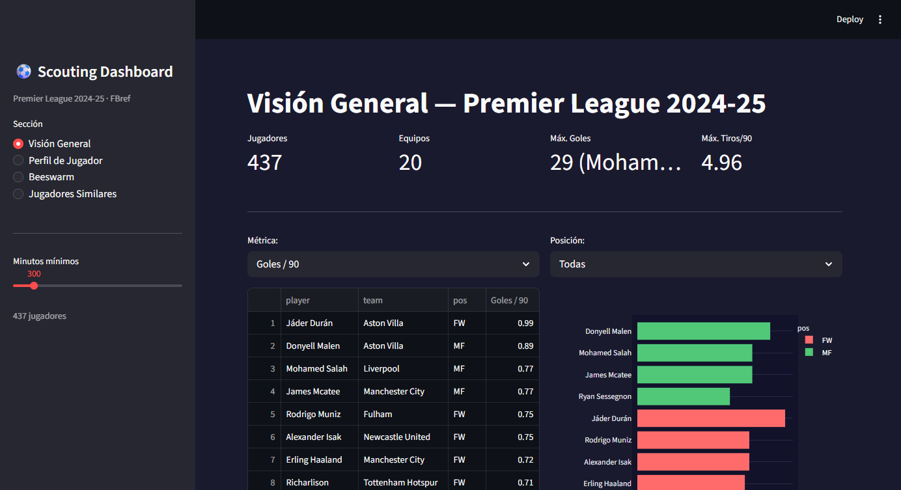

# Proyecto 04 — Scouting Dashboard Interactivo

Dashboard web interactivo para analizar y comparar jugadores de la Premier League 2024-25,
construido con Streamlit y datos de FBref.

<!-- Screenshot del dashboard — reemplazar con imagen real -->


---

## Resumen

Este proyecto cubre técnicas de análisis de rendimiento presentes en currículos de análisis deportivo avanzado:
beeswarm plots, percentiles por posición, similitud de jugadores y visualizaciones de radar.

**Fuente de datos:** FBref (vía `soccerdata`) — Premier League 2024-25  
**Herramienta principal:** Streamlit + Plotly  
**Jugadores analizados:** 437 (mínimo 300 minutos jugados)

---

## Funcionalidades del Dashboard

| Sección | Descripción |
| --- | --- |
| **Visión General** | Top 10 jugadores por métrica, con filtro por posición y gráfico de barras interactivo |
| **Perfil de Jugador** | Percentiles por posición codificados en color (verde / amarillo / rojo) + radar chart |
| **Beeswarm** | Distribución de todos los jugadores sobre una métrica; destaca un jugador específico |
| **Jugadores Similares** | Similitud de coseno sobre todas las métricas numéricas, comparando jugadores de la misma posición |

---

## Métricas analizadas

| Métrica | Descripción |
| --- | --- |
| Goles / 90 | Goles por 90 minutos |
| Asistencias / 90 | Asistencias por 90 minutos |
| Tiros / 90 | Disparos totales por 90 minutos |
| Tiros a puerta / 90 | Disparos en portería por 90 minutos |
| Precisión tiro % | Porcentaje de tiros a puerta |
| Goles por tiro | Eficiencia de remate |
| Tackles ganados / 90 | Duelos defensivos ganados por 90 minutos |
| Intercepciones / 90 | Acciones defensivas de intercepción por 90 minutos |
| Faltas cometidas | Total de infracciones cometidas |
| Faltas recibidas | Total de infracciones recibidas |

---

## Cómo ejecutar

```bash
# 1. Instalar dependencias
pip install streamlit plotly pandas scikit-learn soccerdata

# 2. Descargar datos (solo la primera vez)
python data_prep.py

# 3. Lanzar dashboard
streamlit run app.py
```

El dashboard abre automáticamente en http://localhost:8501

---

## Estructura del proyecto

```
04_scouting/
├── app.py           # Dashboard Streamlit (4 secciones)
├── data_prep.py     # Descarga y prepara datos de FBref
├── data/
│   └── players.csv  # Dataset procesado (437 jugadores × 42 columnas)
└── README.md
```

---

## Conceptos técnicos aplicados

- **Percentile ranking por posición** — `df.groupby('pos')[col].rank(pct=True) * 100`
- **Beeswarm plot** — scatter con jitter aleatorio para evitar superposición de puntos
- **Similitud de coseno** — `sklearn.metrics.pairwise.cosine_similarity` sobre métricas escaladas
- **Radar chart (Plotly Scatterpolar)** — perfil visual de percentiles de un jugador
- **FBref scraping** — `soccerdata.FBref` con caché local automática

---

## Project 04 — Interactive Scouting Dashboard

Interactive web dashboard for analyzing and comparing Premier League 2024-25 players,
built with Streamlit and FBref data.

<!-- Dashboard screenshot — replace with actual image -->


### Overview

This project covers performance analysis techniques common in advanced sports analytics programs:
beeswarm plots, position-adjusted percentiles, player similarity, and radar visualizations.

**Data source:** FBref (via `soccerdata`) — Premier League 2024-25  
**Main tools:** Streamlit + Plotly  
**Players analyzed:** 437 (minimum 300 minutes played)

### Dashboard Sections

| Section | Description |
| --- | --- |
| **Overview** | Top 10 players by metric, filterable by position, interactive bar chart |
| **Player Profile** | Position-adjusted percentile bars color-coded (green / yellow / red) + radar chart |
| **Beeswarm** | Full player distribution on any metric; option to highlight a specific player |
| **Similar Players** | Cosine similarity across all numeric metrics, restricted to same position |

### Metrics

| Metric | Description |
| --- | --- |
| Goals / 90 | Goals scored per 90 minutes |
| Assists / 90 | Assists per 90 minutes |
| Shots / 90 | Total shots per 90 minutes |
| Shots on target / 90 | On-target shots per 90 minutes |
| Shot accuracy % | Percentage of shots on target |
| Goals per shot | Shooting efficiency |
| Tackles won / 90 | Defensive duels won per 90 minutes |
| Interceptions / 90 | Ball interceptions per 90 minutes |
| Fouls committed | Total fouls committed |
| Fouls drawn | Total fouls drawn |

### How to run

```bash
# 1. Install dependencies
pip install streamlit plotly pandas scikit-learn soccerdata

# 2. Download data (first time only)
python data_prep.py

# 3. Launch dashboard
streamlit run app.py
```

The dashboard opens automatically at http://localhost:8501

### Key technical concepts

- **Position-adjusted percentile ranking** — `df.groupby('pos')[col].rank(pct=True) * 100`
- **Beeswarm plot** — scatter with random jitter to prevent point overlap
- **Cosine similarity** — `sklearn.metrics.pairwise.cosine_similarity` on scaled features
- **Radar chart** — Plotly Scatterpolar showing percentile profile
- **FBref scraping** — `soccerdata.FBref` with automatic local cache
