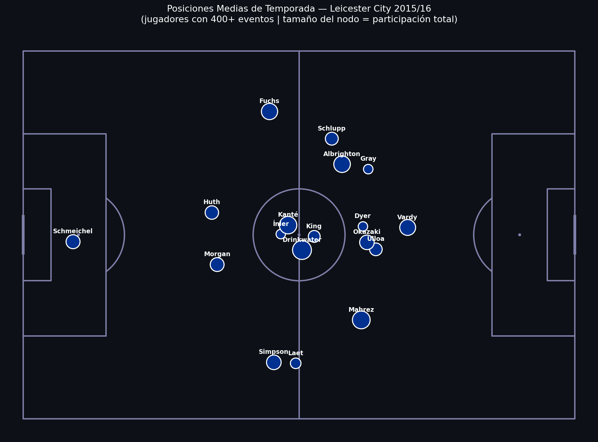
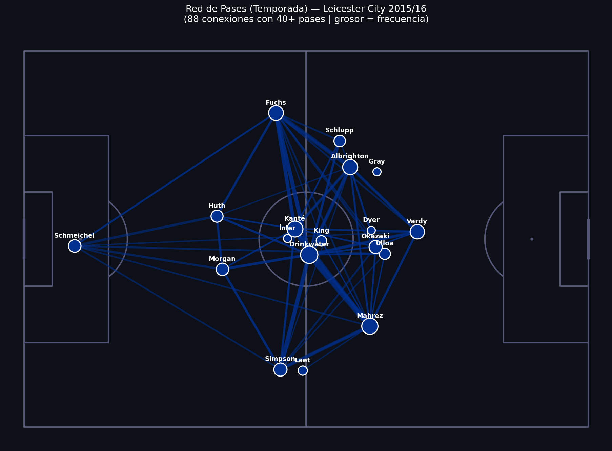
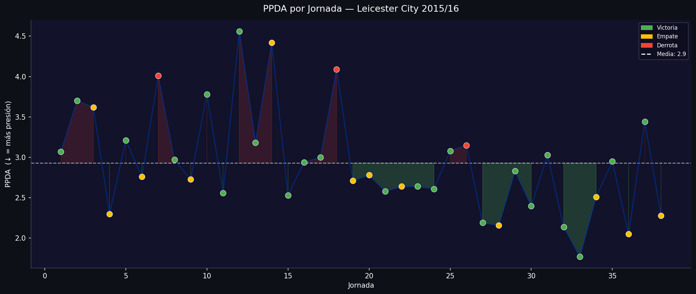
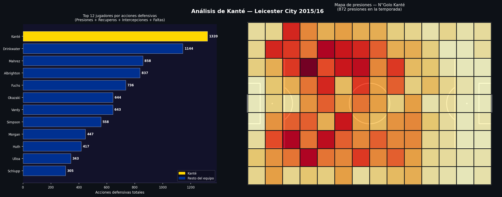
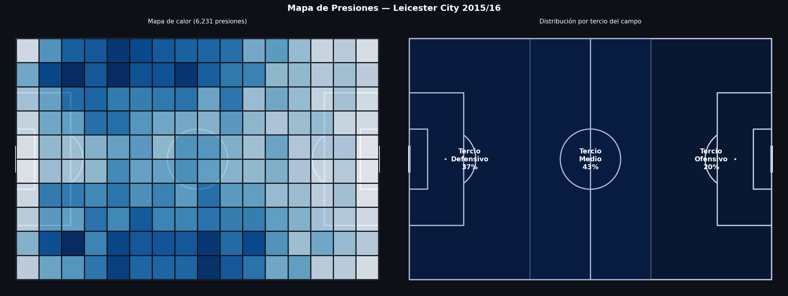
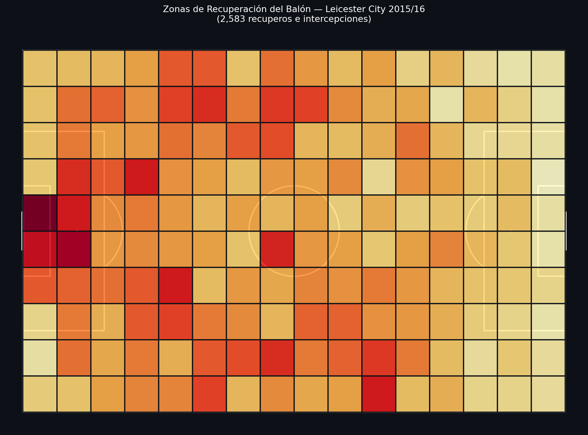

# Proyecto 05 — Análisis Táctico de Equipos

¿Cómo ganó Leicester City la Premier League 2015/16 siendo 5000-1 en las apuestas?
Este proyecto usa datos de eventos de StatsBomb para descomponer el ADN táctico del equipo jornada a jornada.

| Posiciones Medias | Red de Pases |
|---|---|
|  |  |

| PPDA por Jornada | Análisis de Kanté |
|---|---|
|  |  |

| Mapa de Presiones | Zonas de Recuperación |
|---|---|
|  |  |

---

## Análisis realizados

| Visualización | Técnica |
|---|---|
| Posiciones medias de temporada | Media de coordenadas por jugador en 38 partidos |
| Red de pases (temporada completa) | Agregación de conexiones entre jugadores |
| PPDA por jornada | Pases rivales / acciones defensivas propias |
| PPDA por resultado | Relación entre intensidad de presión y resultado |
| Mapa de presiones | Dónde presiona el equipo en el campo |
| Zonas de recuperación | Dónde recupera el balón (recuperos + intercepciones) |
| Análisis de Kanté | Participación individual en las acciones defensivas |

---

## Hallazgos principales

**1. Sistema reactivo, no de presión alta**
El PPDA de Leicester fue consistentemente alto (bloque medio/bajo), contradiciendo la narrativa
de que ganaron por presionar. Su arma fue la transición defensiva–ofensiva, no el pressing.

**2. Kanté dominó las acciones defensivas del equipo**
Un solo centrocampista concentró una fracción desproporcionada de las presiones y recuperos.
Los datos confirman que sin Kanté, el sistema no funciona igual.

**3. La red de pases refleja un juego directo**
Las conexiones más gruesas van desde la defensa directamente hacia los extremos y Vardy,
no a través de un mediocampista creativo clásico.

**4. Recuperaciones en campo propio**
La mayoría de recuperos ocurrieron en su propio campo, confirmando el modelo
de contraataque: defender profundo y salir rápido.

---

## Cómo ejecutar

```bash
# Instalar dependencias (si no están instaladas)
pip install statsbombpy mplsoccer matplotlib pandas numpy jupyter

# Lanzar el notebook
jupyter notebook Tactical_Analysis.ipynb
```

> La primera ejecución descarga eventos de 38 partidos (~2–4 min).
> Las siguientes son instantáneas gracias a la caché local de statsbombpy.

---

## Estructura

```
05_tactical_analysis/
├── Tactical_Analysis.ipynb   # Análisis completo (22 celdas)
├── graficos/                 # Visualizaciones generadas al ejecutar
└── README.md
```

---

## Conceptos técnicos aplicados

- **Normalización de coordenadas** — alinear la dirección de ataque período a período
- **Posiciones medias** — `groupby('player')[['x','y']].mean()` sobre 38 partidos
- **Red de pases season-level** — `groupby(['player', 'pass_recipient']).size()` para toda la temporada
- **PPDA** — `len(opp_passes) / len(def_actions)`, calculado partido a partido
- **Mapas de calor** — `pitch.bin_statistic` + `pitch.heatmap` de mplsoccer

---

## Fuente de datos

[StatsBomb Open Data](https://github.com/statsbomb/open-data) — uso libre para educación e investigación.

---

## Project 05 — Tactical Team Analysis

How did Leicester City win the 2015/16 Premier League at 5000-1 odds?
This project uses StatsBomb event data to decompose the team's tactical DNA across the full season.

| Average Positions | Pass Network |
|---|---|
|  |  |

| PPDA by Matchday | Kanté Analysis |
|---|---|
|  |  |

| Pressing Heatmap | Recovery Zones |
|---|---|
|  |  |

### Analysis performed

| Visualization | Technique |
|---|---|
| Season average positions | Mean x,y per player across 38 matches |
| Season-level pass network | Aggregated connections between players |
| PPDA by matchday | Opponent passes / own defensive actions |
| PPDA by result | Pressing intensity vs match outcome |
| Pressing heatmap | Where on the pitch the team presses |
| Recovery zones | Where the team wins the ball back |
| Kanté analysis | Individual contribution to defensive actions |

### Key findings

**1. Reactive system, not a high press**
Leicester's PPDA was consistently high (mid/low block), contradicting the narrative of pressing to win.
Their weapon was the defensive-to-offensive transition, not pressing.

**2. Kanté dominated team defensive actions**
A single central midfielder concentrated a disproportionate share of pressures and recoveries.
The data confirms the system depended on him.

**3. Direct passing reflected in the pass network**
The thickest connections go from defense directly to wingers and Vardy —
not through a classic creative midfielder.

**4. Recoveries in their own half**
Most ball recoveries happened in their own half, confirming the counter-attack model:
defend deep and transition fast.

### Technical concepts

- **Coordinate normalization** — aligning the attacking direction period by period
- **Season average positions** — `groupby('player')[['x','y']].mean()` over 38 matches
- **Season pass network** — `groupby(['player', 'pass_recipient']).size()` across the full season
- **PPDA** — `len(opp_passes) / len(def_actions)`, calculated per match
- **Heatmaps** — `pitch.bin_statistic` + `pitch.heatmap` from mplsoccer

### Data source

[StatsBomb Open Data](https://github.com/statsbomb/open-data) — free to use for education and research.
