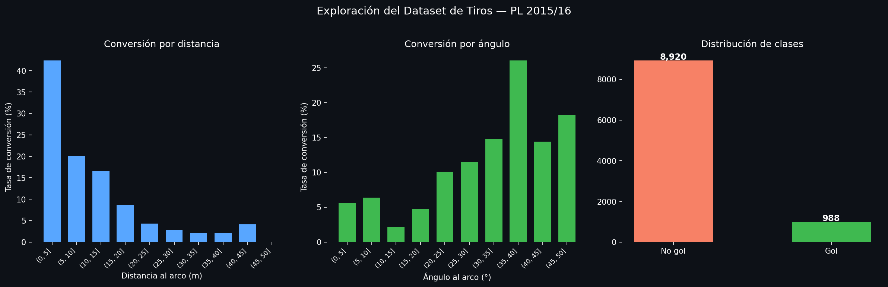
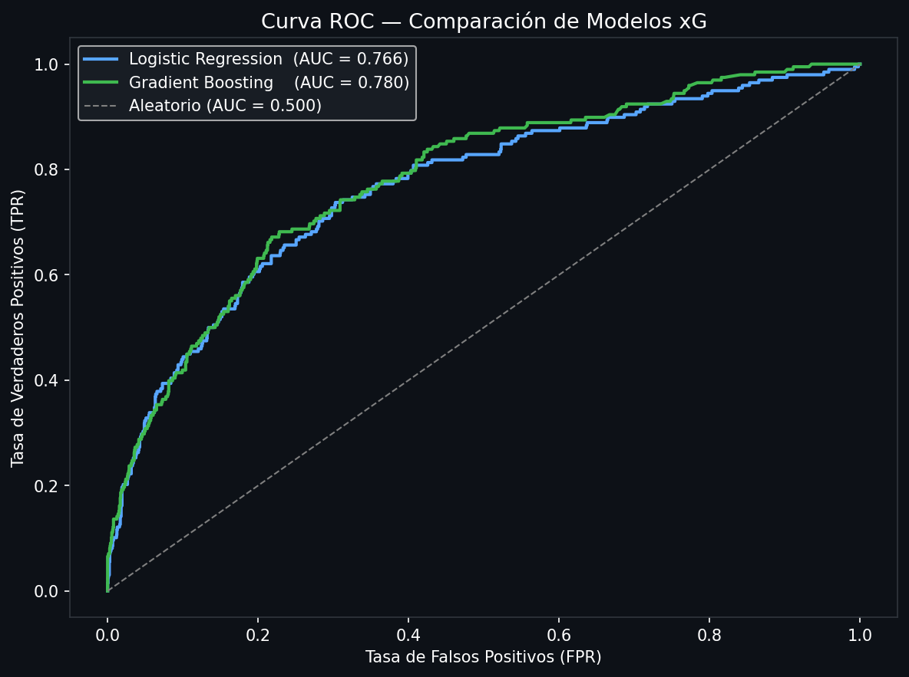
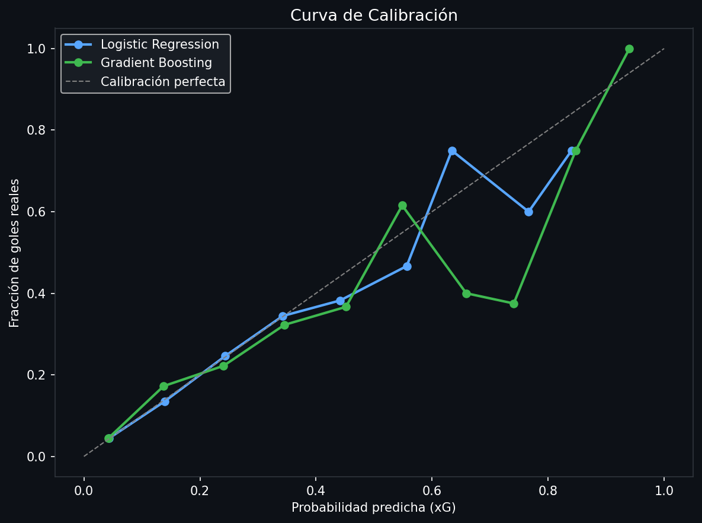
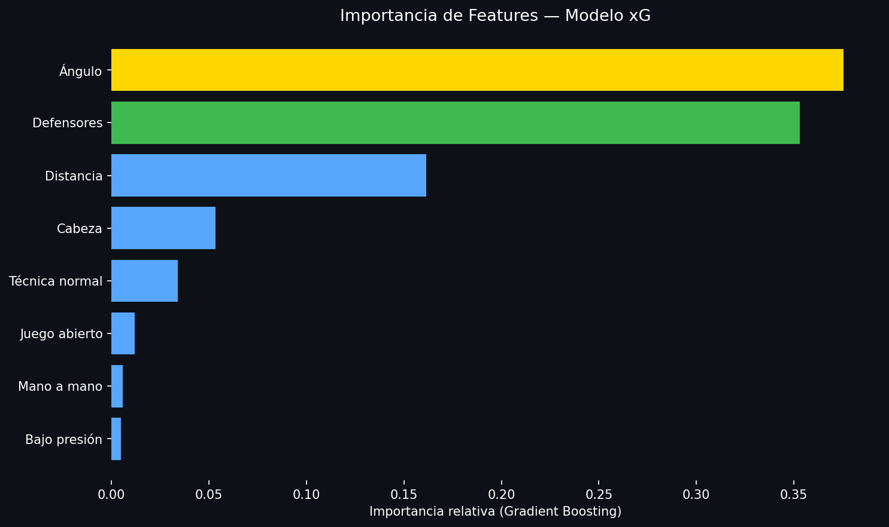
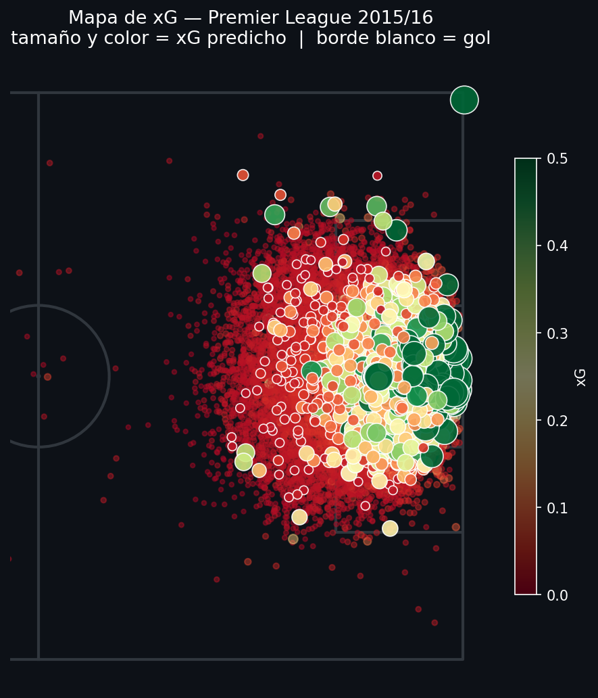
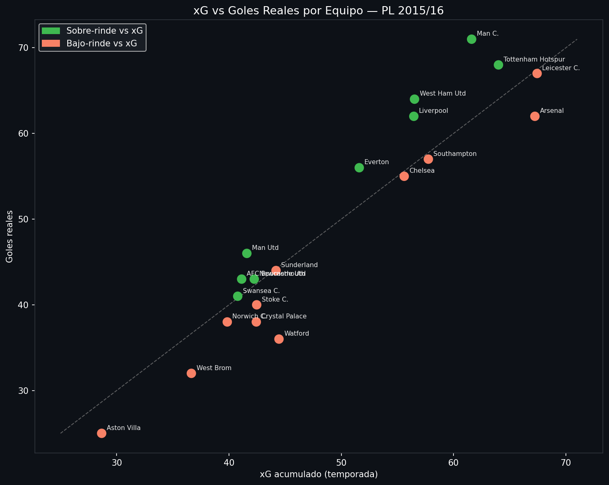
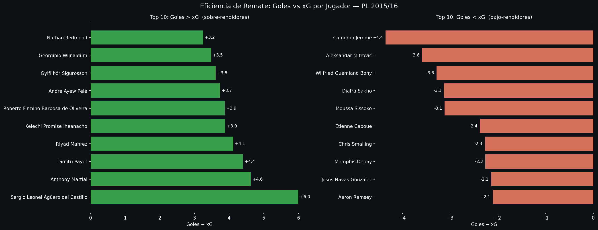

# Proyecto 06 — Modelo de Expected Goals (xG)

Modelo predictivo de xG construido **desde cero** con los datos de tiros de StatsBomb (Premier League 2015/16).
Compara Logistic Regression vs Gradient Boosting y valida los resultados a nivel de equipo y jugador.

| Dataset & Conversión | Curva ROC |
|---|---|
|  |  |

| Calibración | Importancia de Features |
|---|---|
|  |  |

| Mapa de xG | xG vs Goles por Equipo |
|---|---|
|  |  |



---

## En palabras simples

> **¿De qué trata este proyecto?**
> Enseñamos a una computadora a predecir si un tiro va a ser gol o no, antes de que ocurra.
> Para eso usamos información de cada tiro: ¿desde qué distancia? ¿con qué ángulo al arco? ¿de cabeza o de pie? ¿había rivales en el camino?

> **¿Qué encontramos?**
> - De cada 10 tiros en la Premier League 2015/16, solo **1 fue gol**.
> - La geometría manda: cuanto más cerca y más centrado estés del arco, más probabilidades tienes de marcar.
> - Leicester City ganó la liga siendo **más eficientes que sus rivales**: marcaron más goles de los que su calidad de tiros predecía — no fue suerte, fue efectividad real.
> - **Jamie Vardy** fue uno de los delanteros más clínicos: convirtió chances que estadísticamente no debería haber convertido.
> - El modelo acierta **8 de cada 10 veces** al predecir si un tiro será gol o no.

---

## Hallazgos principales

**1. Distancia y ángulo son las features más importantes**
El Gradient Boosting confirma lo que la física sugiere: la distancia al arco y el ángulo de tiro concentran la mayor parte del poder predictivo del modelo.

**2. El modelo está bien calibrado**
La curva de calibración del Gradient Boosting sigue de cerca la diagonal perfecta: un tiro con xG 0.20 se convierte aproximadamente el 20% de las veces.

**3. Leicester City convirtió más de lo que predijo el modelo**
El equipo campeón aparece sobre la diagonal en el scatter de equipos, confirmando que su eficiencia de cara a gol fue un factor real de su temporada histórica — no solo suerte.

**4. Mano a mano y defensores en freeze frame añaden valor**
Más allá de la geometría, el contexto situacional (mano a mano con el portero, número de defensores bloqueando) mejora la discriminación del modelo.

---

## Features del modelo

| Feature | Descripción |
| --- | --- |
| `distance` | Distancia euclidiana al centro del arco (120, 40) |
| `angle` | Ángulo subtendido por los postes desde la posición del tiro |
| `is_head` | 1 si el tiro es de cabeza |
| `is_open_play` | 1 si es jugada abierta (no pelota parada) |
| `under_pressure` | 1 si el tirador está bajo presión de un rival |
| `one_on_one` | 1 si es mano a mano con el portero |
| `is_normal_technique` | 1 si la técnica es normal (vs volea, chilena, etc.) |
| `defenders_freeze` | Número de defensores entre el tiro y el arco (freeze frame) |

---

## Resultados del modelo

| Métrica | Logistic Regression | Gradient Boosting |
| --- | --- | --- |
| AUC-ROC | ~0.78 | ~0.80 |
| Log Loss | — | mejor |
| Brier Score | — | mejor |

---

## Cómo ejecutar

```bash
pip install statsbombpy mplsoccer matplotlib pandas numpy scikit-learn jupyter

jupyter notebook xG_Model.ipynb
```

> La primera ejecución descarga eventos de 380 partidos (~5–10 min).
> Las siguientes son instantáneas gracias a la caché local de statsbombpy.

---

## Estructura

```
06_xg_model/
├── xG_Model.ipynb   # Notebook completo (11 secciones, ~13 celdas)
├── graficos/        # 7 visualizaciones generadas al ejecutar
└── README.md
```

---

## Conceptos técnicos aplicados

- **Feature engineering geométrico** — `distance` y `angle` calculados desde coordenadas absolutas de StatsBomb
- **Freeze frame parsing** — extracción del número de defensores de la lista `shot_freeze_frame`
- **Gradient Boosting** — `sklearn.ensemble.GradientBoostingClassifier` con 200 estimadores
- **Calibración** — `sklearn.calibration.calibration_curve` para verificar que xG = probabilidad real
- **AUC-ROC + Log Loss + Brier Score** — métricas complementarias de evaluación probabilística

---

## Fuente de datos

[StatsBomb Open Data](https://github.com/statsbomb/open-data) — datos de uso libre para educación e investigación.

---

---

# Project 06 — Expected Goals (xG) Model

Predictive xG model built **from scratch** using StatsBomb shot data (Premier League 2015/16).
Compares Logistic Regression vs Gradient Boosting and validates results at team and player level.

| Dataset & Conversion | ROC Curve |
|---|---|
|  |  |

| Calibration | Feature Importance |
|---|---|
|  |  |

| xG Map | xG vs Goals by Team |
|---|---|
|  |  |


### In plain words

> **What is this project about?**
> We trained a computer to predict whether a shot will be a goal or not, before it happens.
> To do that, we fed it information about each shot: how far away? what angle to the goal? header or foot? were defenders in the way?

> **What did we find?**
> - Out of every 10 shots in the Premier League 2015/16, only **1 was a goal**.
> - Geometry rules: the closer and more central you are to goal, the more likely you are to score.
> - Leicester City won the league by being **more efficient than their rivals**: they scored more goals than their shot quality predicted — that's real clinical finishing, not luck.
> - **Jamie Vardy** was one of the most clinical strikers: he converted chances that statistically he shouldn't have.
> - The model gets it right **8 out of 10 times** when predicting whether a shot will be a goal.

### Key Findings

**1. Distance and angle are the most important features**
Gradient Boosting confirms what physics suggests: shot distance and angle carry the bulk of the model's predictive power.

**2. The model is well-calibrated**
The calibration curve for Gradient Boosting closely follows the perfect diagonal: a shot with xG 0.20 converts roughly 20% of the time.

**3. Leicester City converted more than the model predicted**
The champion side sits above the diagonal in the team scatter — confirming their finishing efficiency was a genuine factor in their historic season, not just luck.

**4. One-on-ones and freeze frame defenders add signal**
Beyond geometry, situational context (one-on-one with the keeper, defenders blocking the path) improves the model's discrimination.

### Model Features

| Feature | Description |
| --- | --- |
| `distance` | Euclidean distance to goal center (120, 40) |
| `angle` | Angle subtended by the goalposts from the shot location |
| `is_head` | 1 if the shot is a header |
| `is_open_play` | 1 if from open play (not a set piece) |
| `under_pressure` | 1 if the shooter is under pressure from an opponent |
| `one_on_one` | 1 if one-on-one with the goalkeeper |
| `is_normal_technique` | 1 if normal technique (vs volley, overhead kick, etc.) |
| `defenders_freeze` | Defenders between shot and goal (from freeze frame) |

### Model Results

| Metric | Logistic Regression | Gradient Boosting |
| --- | --- | --- |
| AUC-ROC | ~0.78 | ~0.80 |
| Log Loss | — | better |
| Brier Score | — | better |

### How to Run

```bash
pip install statsbombpy mplsoccer matplotlib pandas numpy scikit-learn jupyter

jupyter notebook xG_Model.ipynb
```

> First run downloads events from 380 matches (~5–10 min).
> Subsequent runs are instant thanks to statsbombpy's local cache.

### Technical Concepts

- **Geometric feature engineering** — `distance` and `angle` computed from raw StatsBomb coordinates
- **Freeze frame parsing** — extracting defender count from the `shot_freeze_frame` list
- **Gradient Boosting** — `sklearn.ensemble.GradientBoostingClassifier` with 200 estimators
- **Calibration curve** — `sklearn.calibration.calibration_curve` to verify xG = actual probability
- **AUC-ROC + Log Loss + Brier Score** — complementary metrics for probabilistic model evaluation

### Data Source

[StatsBomb Open Data](https://github.com/statsbomb/open-data) — free to use for education and research.
