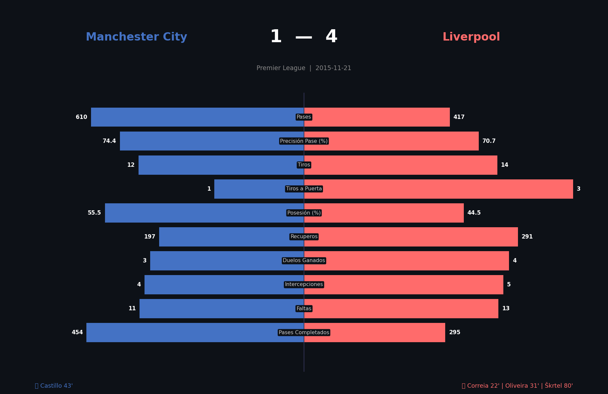
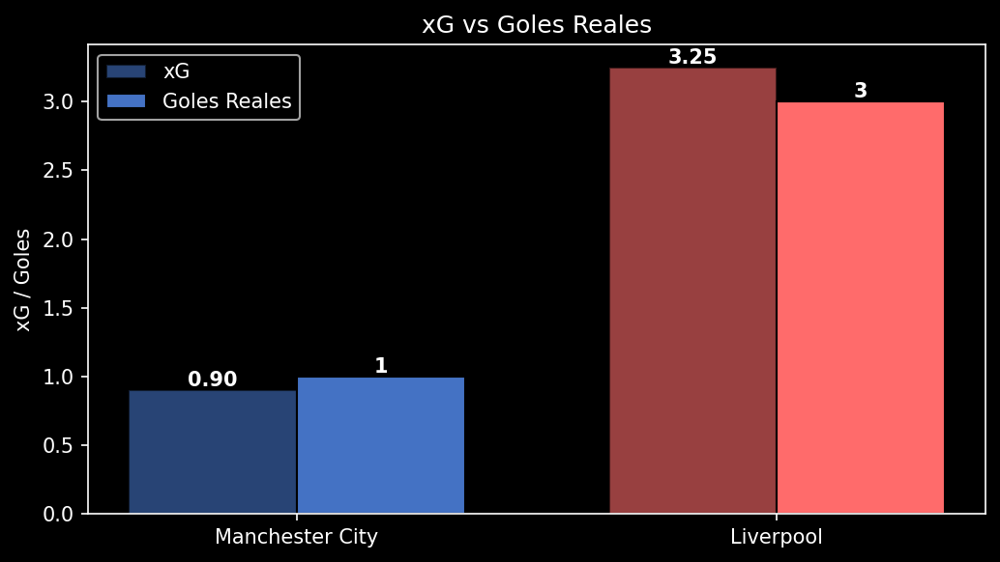
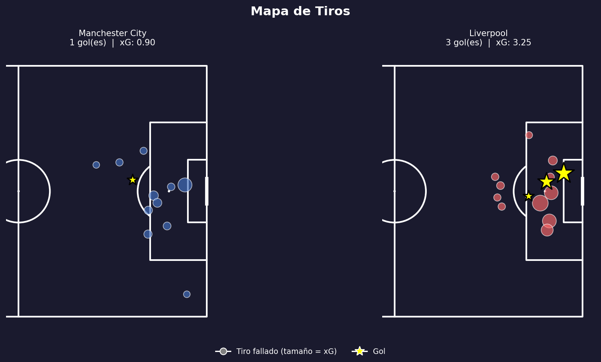
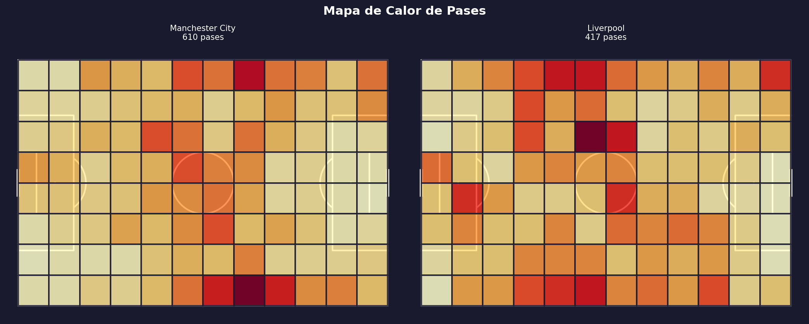
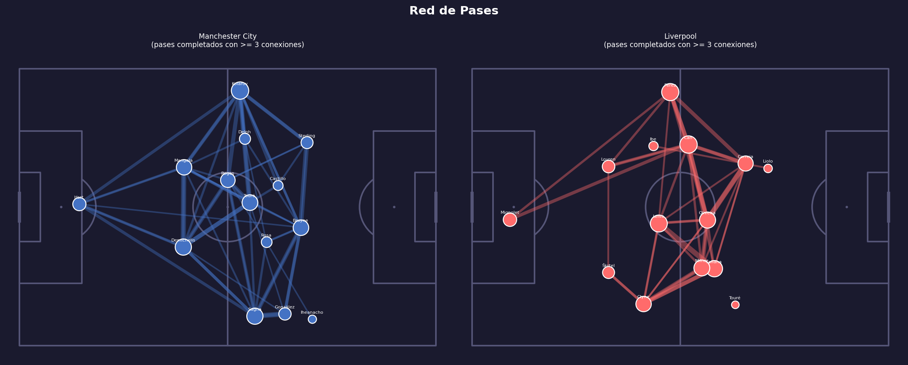

# Football Analytics con StatsBomb

Colección de proyectos de análisis de fútbol usando datos abiertos de **StatsBomb** y Python.

---

## Proyectos

| # | Proyecto | Herramientas | Descripción |
| --- | --- | --- | --- |
| 01 | [Manchester City vs Liverpool](Analisis_StatsBomb.ipynb) | Python · mplsoccer | Análisis profundo de un partido: xG, mapas de tiros, red de pases, evolución por minuto |
| 02 | [Análisis de Temporada con SQL](02_season_analysis/) | SQLite · pandas | Base de datos con 1.3M eventos, consultas SQL sobre los 380 partidos de la Premier League 2015/16 |
| 03 | [Perfiles de Jugadores con ML](03_player_profiles/) | scikit-learn · KMeans | Clustering de 502 jugadores en 5 perfiles tácticos, radar charts y comparador individual |
| 04 | [Scouting Dashboard](04_scouting/) | Streamlit · Plotly · FBref | Dashboard interactivo con beeswarm, percentiles por posición y similitud de jugadores (PL 2024-25) |
| 05 | [Análisis Táctico](05_tactical_analysis/) | mplsoccer · StatsBomb | Posiciones medias, red de pases de temporada, PPDA y mapas de presión — Leicester City 2015/16 |

---

## Proyecto 01 — Manchester City 1–4 Liverpool

Análisis en profundidad del partido **Manchester City 1 – 4 Liverpool** (Premier League, 21 Nov 2015).

### Hallazgos principales

**1. Liverpool ganó sin tener el balón**
Manchester City dominó la posesión (55.5% vs 44.5%) y dio más pases (610 vs 417), pero eso no se tradujo en peligro real.

**2. El xG justifica el resultado**
Liverpool generó un xG de **3.25** frente al **0.90** de Manchester City. Sus ocasiones fueron de mayor calidad — la mayoría desde dentro del área.

**3. Liverpool presionó y recuperó mucho más**
Con **291 recuperos de balón** contra 197 de Manchester City, Liverpool aplicó una presión sistemática que generó transiciones rápidas.

**4. La primera mitad fue determinante**
Liverpool marcó tres goles antes del descanso (22', 31', 43'). Manchester City nunca pudo reaccionar tácticamente.

**5. La red de pases revela estilos opuestos**
Manchester City distribuyó desde atrás con Kolarov (86 pases) como principal circulador. Liverpool mostró conexiones densas en el mediocampo, facilitando transiciones verticales.

### Visualizaciones











### Métricas por equipo

| Métrica | Manchester City | Liverpool |
| --- | --- | --- |
| Total Pases | 610 | 417 |
| Precisión de Pase | 74.4% | 70.7% |
| Tiros | 12 | 14 |
| Tiros a Puerta | 1 | 3 |
| Posesión | 55.5% | 44.5% |
| Recuperos de Balón | 197 | 291 |
| xG | 0.90 | 3.25 |

---

## Tecnologías

- **Python 3** · **statsbombpy** · **pandas** · **matplotlib** · **mplsoccer** · **scikit-learn** · **SQLite3** · **Streamlit** · **Plotly** · **soccerdata**

## Cómo ejecutar

```bash
pip install statsbombpy mplsoccer pandas matplotlib scikit-learn jupyter
jupyter notebook Analisis_StatsBomb.ipynb
```

## Nota sobre archivos generados

Los archivos `.db` no están incluidos en el repositorio por su tamaño. Se generan automáticamente al ejecutar cada notebook (5–10 minutos de descarga inicial).

## Fuente de datos

[StatsBomb Open Data](https://github.com/statsbomb/open-data) — datos de uso libre para educación e investigación.

---

---

## Football Analytics with StatsBomb

A collection of football data analysis projects using **StatsBomb** open data and Python.

---

## Projects

| # | Project | Tools | Description |
| --- | --- | --- | --- |
| 01 | [Manchester City vs Liverpool](Analisis_StatsBomb.ipynb) | Python · mplsoccer | Deep single-match analysis: xG, shot maps, pass networks, minute-by-minute evolution |
| 02 | [Season Analysis with SQL](02_season_analysis/) | SQLite · pandas | Database with 1.3M events, SQL queries across all 380 matches of the 2015/16 Premier League |
| 03 | [Player Profiling with ML](03_player_profiles/) | scikit-learn · KMeans | Clustering 502 players into 5 tactical profiles, radar charts and individual comparison tool |
| 04 | [Scouting Dashboard](04_scouting/) | Streamlit · Plotly · FBref | Interactive dashboard with beeswarm plots, position-adjusted percentiles and player similarity (PL 2024-25) |
| 05 | [Tactical Analysis](05_tactical_analysis/) | mplsoccer · StatsBomb | Average positions, season pass network, PPDA and pressing maps — Leicester City 2015/16 |

---

## Project 01 — Manchester City 1–4 Liverpool

In-depth analysis of **Manchester City 1 – 4 Liverpool** (Premier League, 21 Nov 2015).

### Key Findings

**1. Liverpool won without the ball**
Manchester City dominated possession (55.5% vs 44.5%) and completed more passes (610 vs 417), but that did not translate into real danger.

**2. xG justifies the scoreline**
Liverpool generated an xG of **3.25** vs **0.90** for Manchester City. Their chances were of much higher quality — mostly from inside the box.

**3. Liverpool pressed and recovered far more**
With **291 ball recoveries** vs 197 for Manchester City, Liverpool applied systematic pressure that generated quick transitions.

**4. The first half was decisive**
Liverpool scored three goals before half-time (22', 31', 43'). Manchester City was unable to adjust tactically.

**5. Pass networks reveal opposite styles**
Manchester City built from the back with Kolarov (86 passes) as the main distributor. Liverpool showed dense central midfield connections, enabling vertical transitions.

### Visualizations


### Team Statistics

| Metric | Manchester City | Liverpool |
| --- | --- | --- |
| Total Passes | 610 | 417 |
| Pass Accuracy | 74.4% | 70.7% |
| Shots | 12 | 14 |
| Shots on Target | 1 | 3 |
| Possession | 55.5% | 44.5% |
| Ball Recoveries | 197 | 291 |
| xG | 0.90 | 3.25 |

---

## Tech Stack

- **Python 3** · **statsbombpy** · **pandas** · **matplotlib** · **mplsoccer** · **scikit-learn** · **SQLite3** · **Streamlit** · **Plotly** · **soccerdata**

## How to Run

```bash
pip install statsbombpy mplsoccer pandas matplotlib scikit-learn jupyter
jupyter notebook Analisis_StatsBomb.ipynb
```

## Note on Generated Files

`.db` files are not included in the repository due to their size. They are generated automatically when running each notebook (initial download takes 5–10 minutes).

## Data Source

[StatsBomb Open Data](https://github.com/statsbomb/open-data) — free to use for education and research.
