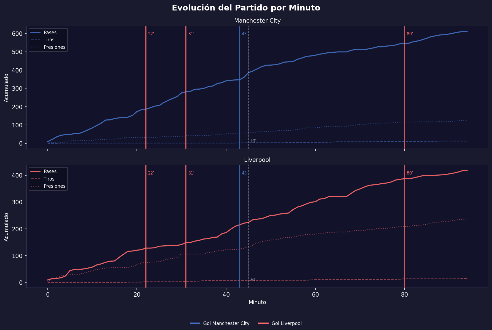
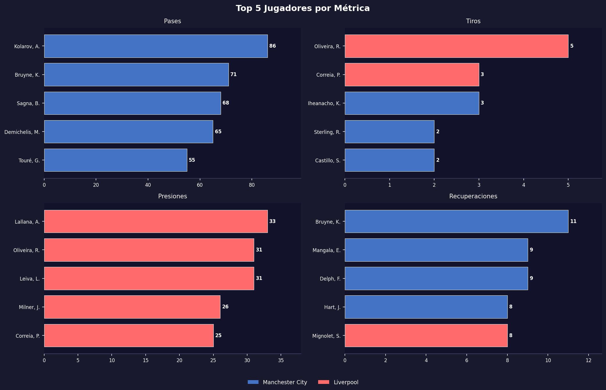

# Football Analytics con StatsBomb

Colección de proyectos de análisis de fútbol usando datos abiertos de **StatsBomb** y Python.

---

## Proyectos

| # | Proyecto | Descripción |
|---|---|---|
| 01 | [Manchester City vs Liverpool](Analisis_StatsBomb.ipynb) | Análisis profundo de un partido: xG, mapas de tiros, red de pases, evolución por minuto |
| 02 | [Análisis de Temporada con SQL](02_season_analysis/) | Base de datos SQLite con 1.3M eventos, consultas SQL sobre los 380 partidos de la Premier League 2015/16 |

---

## Proyecto 01 — Manchester City 1–4 Liverpool

Análisis en profundidad del partido **Manchester City 1 – 4 Liverpool** (Premier League, 21 Nov 2015).

---

## Resumen Ejecutivo

### Contexto
El partido **Manchester City 1 – 4 Liverpool** del 21 de noviembre de 2015 es uno de los resultados más sorprendentes de la Premier League 2015/16. Manchester City llegaba como favorito jugando de local, con mayor posesión y volumen de pases. Sin embargo, Liverpool fue ampliamente superior en las métricas que realmente determinan el resultado.

### Hallazgos principales

**1. Liverpool ganó sin tener el balón**  
Manchester City dominó la posesión (55.5% vs 44.5%) y dio significativamente más pases (610 vs 417), pero eso no se tradujo en peligro real. Liverpool demostró que la eficiencia supera al volumen.

**2. El xG justifica el resultado**  
El modelo de Expected Goals confirma la superioridad de Liverpool: generó un xG de **3.25** frente al **0.90** de Manchester City. Liverpool no solo marcó más, sino que sus ocasiones fueron de mayor calidad — la mayoría desde dentro del área y en posiciones frontales al arco.

**3. Liverpool presionó y recuperó mucho más**  
Con **291 recuperos de balón** contra 197 de Manchester City, Liverpool aplicó una presión sistemática que generó transiciones rápidas. Adam Lallana lideró las presiones con 33 acciones, seguido de Roberto Firmino con 31.

**4. La primera mitad fue determinante**  
El análisis de la evolución por minuto muestra que Liverpool marcó tres goles antes del descanso (22', 31', 43'), rompiendo el partido en la primera mitad. Manchester City nunca pudo reaccionar tácticamente.

**5. La red de pases revela estilos opuestos**  
Manchester City distribuyó desde atrás con Kolarov (86 pases) como principal circulador, generando una red amplia pero con pocas conexiones profundas. Liverpool en cambio mostró conexiones densas en el mediocampo central, facilitando transiciones más verticales.

**6. De Bruyne lideró recuperaciones para Man City**  
Con 11 recuperaciones, Kevin De Bruyne fue el jugador más activo defensivamente para Manchester City, lo que refleja el esfuerzo individual ante una presión colectiva de Liverpool.

### Conclusión
Liverpool ejecutó un plan táctico preciso: ceder posesión, presionar alto, recuperar rápido y finalizar con eficacia. El resultado 4-1 no fue una sorpresa estadística — los datos lo respaldan completamente.

---

## Visualizaciones

### Tarjeta Resumen del Partido


### xG vs Goles Reales


### Mapa de Tiros


### Mapa de Calor de Pases


### Red de Pases


### Evolución del Partido por Minuto


### Top 5 Jugadores por Métrica


---

## Métricas analizadas (por equipo)

| Métrica | Manchester City | Liverpool |
|---|---|---|
| Total Pases | 610 | 417 |
| Precisión de Pase | 74.4% | 70.7% |
| Tiros | 12 | 14 |
| Tiros a Puerta | 1 | 3 |
| Posesión | 55.5% | 44.5% |
| Recuperos de Balón | 197 | 291 |
| Duelos Ganados | 3 | 4 |
| Intercepciones | 4 | 5 |
| Faltas Cometidas | 11 | 13 |
| xG | 0.90 | 3.25 |

---

## Tecnologías

- **Python 3**
- **statsbombpy** — acceso a datos abiertos de StatsBomb
- **pandas** — manipulación de datos
- **matplotlib** — gráficos estáticos
- **mplsoccer** — visualizaciones sobre campo de fútbol
- **Jupyter Notebook**

## Cómo ejecutar

```bash
pip install statsbombpy mplsoccer pandas matplotlib jupyter
jupyter notebook Analisis_StatsBomb.ipynb
```

Ejecuta las celdas en orden de arriba hacia abajo. Los gráficos se guardan automáticamente en la carpeta `graficos/`.

---

## Fuente de datos

[StatsBomb Open Data](https://github.com/statsbomb/open-data) — datos de uso libre para educación e investigación.